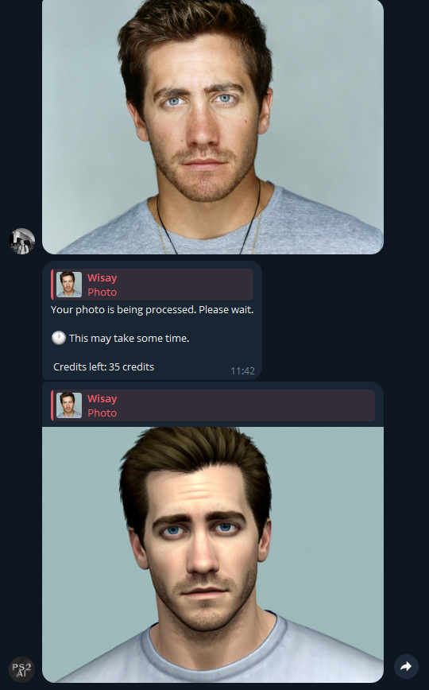

# AI Photo Generation Telegram_Bot

## Overview

*This project is a Telegram bot designed to process images using artificial intelligence. Built with Python, aiogram, and PostgreSQL, this bot allows users to submit photos which are then processed using AI techniques. Users can manage their usage through a credit system, which supports purchases via Stripe.*

## Features
**Image Processing**: Users can send photos to the bot, which uses AI to analyze and process the images.

**Credit System**: Credits for processing images can be purchased through Stripe, ensuring easy payment and access management.

**User-friendly Interface**: Seamless integration with Telegram for a straightforward user experience.
Scalable Backend: Utilizes PostgreSQL for robust data management and scalability.

## Screenshots

## Authors

- [@wisay](https://github.com/wisayy)

